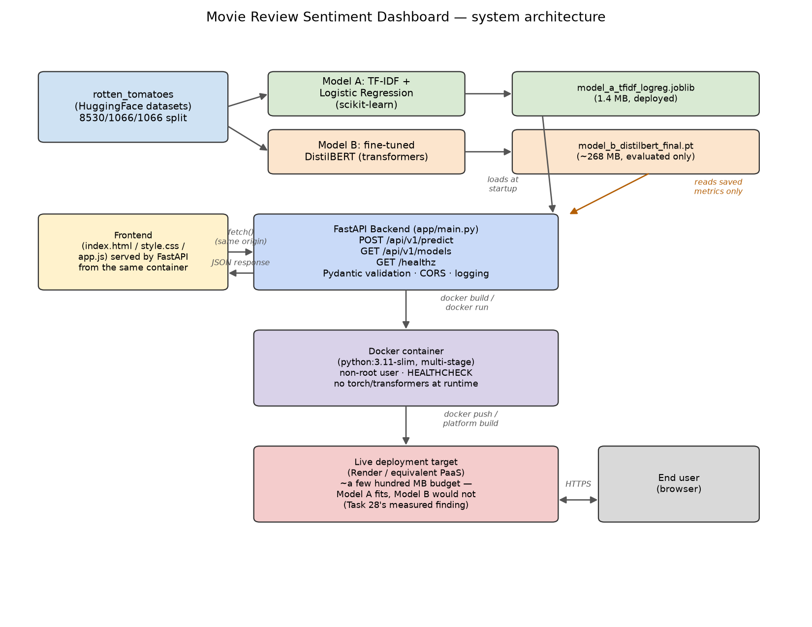

# Movie Review Sentiment Dashboard — Capstone Project

**PKCERT AI & Software Development Internship — Final Capstone Task**
Author: Abdullah Amir

A web dashboard that classifies movie review sentiment (positive/negative) live, via a
trained model served through a REST API. Built to demonstrably integrate skills across the
internship: Task 27's static-vs-contextual-embeddings comparison *is* this project's actual
model-selection decision (not a side note), and the backend/deployment approach directly
applies Task 28's hard-won, measured lesson about free-tier memory limits.

**Full write-up**: see `docs/part_a_scope_and_planning.md` for the scoping/planning
document, and `FINAL_REPORT.md` for the complete capstone report (Parts B–E).

## Project overview

| | |
|---|---|
| **Problem** | Quick, free, no-signup sentiment classification for movie-review-style text |
| **Data** | [`rotten_tomatoes`](https://huggingface.co/datasets/rotten_tomatoes) (HF `datasets`), 8,530/1,066/1,066 train/val/test, binary, balanced |
| **Model A (deployed)** | TF-IDF (unigrams+bigrams) + Logistic Regression — **78.7% test accuracy**, 1.4MB artifact |
| **Model B (trained, compared)** | Fine-tuned DistilBERT — **85.3% test accuracy**, 268MB artifact, not deployed (see `FINAL_REPORT.md` for the full trade-off) |
| **Backend** | FastAPI, async, Pydantic-validated, serves Model A only |
| **Frontend** | Static HTML/CSS/JS dashboard, served from the same container |
| **Deployment** | Docker (multi-stage, non-root, 645MB image — no torch/transformers at runtime); **live at [day29-sentiment-dashboard.onrender.com](https://day29-sentiment-dashboard.onrender.com)** (Render free tier) |

## Architecture



## Repository layout

```
Day_29/
├── docs/
│   ├── part_a_scope_and_planning.md   # Part A: scope, stack, plan, success criteria
│   └── generate_architecture_diagram.py
├── model/
│   ├── common.py                       # shared data-loading helper
│   ├── train_baseline.py               # Part B: Model A (TF-IDF + LogReg)
│   ├── train_transformer.py            # Part B: Model B (fine-tuned DistilBERT)
│   ├── artifacts/                      # saved model files
│   ├── results/                        # evaluation JSON (both models)
│   └── figures/                        # curves, confusion matrices, architecture diagram
├── backend/
│   ├── app/                            # FastAPI application
│   ├── requirements.txt
│   └── Dockerfile
├── frontend/                           # static dashboard (HTML/CSS/JS)
├── tests/
│   └── test_api.py                     # Part D: functional test suite
├── presentation/                       # Part E: slide deck
├── docker-compose.yml
├── FINAL_REPORT.md                     # Parts B-E capstone report
├── DAILY_LOGS.md                       # Part E: internship daily-log compilation
└── INTERNSHIP_REPORT.md                # Part E: final internship reflection
```

## Setup & run locally

```bash
# 1. Environment
python3 -m venv venv
source venv/bin/activate
pip install torch --index-url https://download.pytorch.org/whl/cpu   # only needed to retrain Model B
pip install -r backend/requirements.txt
pip install transformers==4.57.6 scikit-learn datasets matplotlib pandas numpy sentencepiece joblib pytest httpx  # for model/ scripts + tests

# 2. (Optional) retrain the models -- pre-trained artifacts are already committed
cd model
python train_baseline.py       # ~10s
python train_transformer.py    # ~35-45 min CPU (no GPU needed, but slow without one)
cd ..

# 3. Run the backend (serves the frontend too, at the same URL)
cd backend
uvicorn app.main:app --host 0.0.0.0 --port 8000
# visit http://localhost:8000
```

## Run via Docker

```bash
docker compose up --build
# visit http://localhost:8000
```

## Run the tests

```bash
source venv/bin/activate
python -m pytest tests/test_api.py -v
```

## API contract

| Endpoint | Method | Description |
|---|---|---|
| `/healthz` | GET | Health check + whether Model A is loaded |
| `/api/v1/predict` | POST | `{"text": "..."}` → `{"label": "positive"\|"negative", "confidence": float, "latency_ms": float}` |
| `/api/v1/models` | GET | Both models' evaluation metrics, for the dashboard's comparison panel |

Full interactive docs (Swagger UI) at `/docs` once the server is running.

## Usage example

```bash
curl -X POST http://localhost:8000/api/v1/predict \
  -H "Content-Type: application/json" \
  -d '{"text": "This film was a delightful surprise, with sharp writing and a career-best performance."}'
# {"label":"positive","confidence":0.72,"latency_ms":11.6}
```

## Environment variables (deployment configuration)

| Variable | Default | Purpose |
|---|---|---|
| `PORT` | `8000` | Port the server listens on |
| `MODEL_A_PATH` | (relative path) | Override if the model artifact lives elsewhere (set explicitly in `Dockerfile`, since the container's directory depth differs from local dev) |
| `RESULTS_DIR` | (relative path) | Same reasoning, for the model-comparison endpoint's data source |
| `FRONTEND_DIR` | (relative path) | Same reasoning, for static file serving |

## License / data note

`rotten_tomatoes` is a standard, permissively-licensed NLP research/education benchmark
dataset, used here for a non-commercial educational capstone project.
