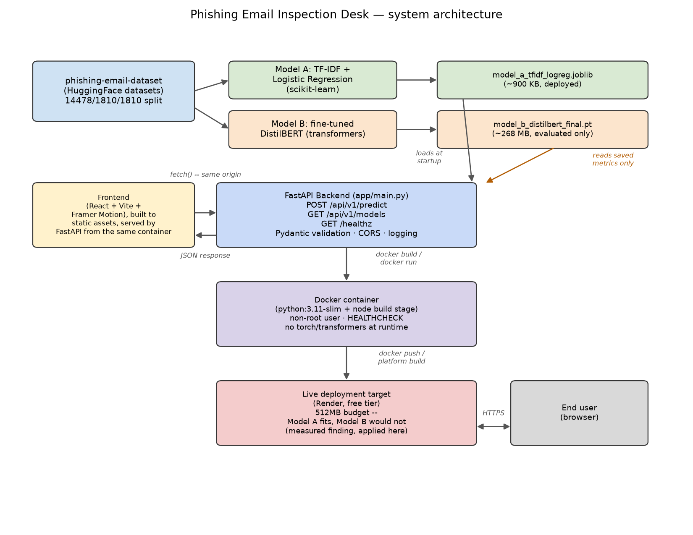

# Phishing Email Inspection Desk — Capstone Project

**PKCERT AI & Software Development Internship — Final Capstone Task**
Author: Abdullah Amir

A web tool that classifies pasted email text as phishing or safe, live, via a trained model
served through a REST API. Built to demonstrably integrate skills across the internship:
Task 27's static-vs-contextual-embeddings comparison *is* this project's actual
model-selection decision (not a side note), and the deployment approach directly applies an
earlier project's measured lesson about free-tier memory limits.

**Full write-up**: see `docs/part_a_scope_and_planning.md` for the scoping/planning
document, and `FINAL_REPORT.md` for the complete capstone report (Parts B–E).

## Project overview

| | |
|---|---|
| **Problem** | Quick, free, no-signup phishing/safe classification for pasted email text |
| **Data** | [`zefang-liu/phishing-email-dataset`](https://huggingface.co/datasets/zefang-liu/phishing-email-dataset) (HF `datasets`), 18,650 emails, 80/10/10 split |
| **Model A (deployed)** | TF-IDF (unigrams+bigrams) + Logistic Regression — see `FINAL_REPORT.md` for its measured test accuracy |
| **Model B (trained, compared)** | Fine-tuned DistilBERT — contextual-embeddings comparison, see `FINAL_REPORT.md` for its measured results |
| **Backend** | FastAPI, async, Pydantic-validated, serves Model A only |
| **Frontend** | React + Vite + Framer Motion, built to static assets, served from the same container |
| **Deployment** | Docker (multi-stage, Node build stage + Python runtime, non-root, ~650MB image — no torch/transformers at runtime); live at [day29-phishing-inspector.onrender.com](https://day29-phishing-inspector.onrender.com) (Render free tier) |

## Architecture



## Repository layout

```
Day_29/
├── PRODUCT.md                  Product context (Impeccable design workflow)
├── docs/
│   ├── part_a_scope_and_planning.md
│   └── generate_architecture_diagram.py
├── model_v2/
│   ├── common.py                Data loading + cleaning
│   ├── train_baseline.py        Model A training
│   ├── train_transformer.py     Model B training
│   ├── artifacts/                Saved models (Model B weights gitignored, >100MB)
│   ├── results/                  Metrics JSON (read live by the backend)
│   └── figures/                  Confusion matrices, training curves, architecture diagram
├── backend/
│   ├── app/                      FastAPI application
│   ├── Dockerfile
│   └── requirements.txt
├── frontend-app/                 React + Vite + Framer Motion source
├── tests/test_api.py             16 pytest cases
├── docker-compose.yml
├── presentation/slides.html
├── DAILY_LOGS.md
├── INTERNSHIP_REPORT.md
└── FINAL_REPORT.md
```

## Setup & run locally

### Backend + frontend (Docker, recommended)

```bash
cd Day_29
docker compose up --build
# → http://localhost:8000
```

### Backend only (local Python)

```bash
cd Day_29/backend
python -m venv venv && source venv/bin/activate
pip install -r requirements.txt
MODEL_A_PATH=../model_v2/artifacts/model_a_tfidf_logreg.joblib \
RESULTS_DIR=../model_v2/results \
FRONTEND_DIR=../frontend-app/dist \
uvicorn app.main:app --reload
```

### Frontend only (local dev, hot reload)

```bash
cd Day_29/frontend-app
npm install
npm run dev
# proxy /healthz, /api/* to a locally running backend, or npm run build
# and let the backend serve the built dist/ directly
```

### Retraining the models

```bash
cd Day_29/model_v2
python -m venv venv && source venv/bin/activate
pip install -r ../model_v2/requirements.txt   # or see requirements.txt in model_v2/
python train_baseline.py       # Model A -- a few seconds
python train_transformer.py    # Model B -- CPU fine-tuning, expect a long run
```

## API contract

| Endpoint | Method | Request | Response |
|---|---|---|---|
| `/healthz` | GET | — | `{status, model_loaded, uptime_s}` |
| `/api/v1/predict` | POST | `{text: str}` (1–5000 chars) | `{label: "safe"\|"phishing", confidence, latency_ms}` |
| `/api/v1/models` | GET | — | `{models: [...]}` — both models' real measured metrics |

```bash
curl -X POST https://day29-phishing-inspector.onrender.com/api/v1/predict \
  -H "Content-Type: application/json" \
  -d '{"text": "Verify your account within 24 hours or it will be suspended. Click here."}'
```

## Environment variables

| Variable | Default (local) | Purpose |
|---|---|---|
| `MODEL_A_PATH` | `model_v2/artifacts/model_a_tfidf_logreg.joblib` | Path to the deployed model artifact |
| `RESULTS_DIR` | `model_v2/results` | Path to both models' saved evaluation JSON |
| `FRONTEND_DIR` | `frontend-app/dist` | Path to the built static frontend |
| `PORT` | `8000` | Server port |

## Data & license note

The dataset is used for non-commercial educational purposes. This tool performs detection
only — it never generates, templates, or suggests phishing content.
